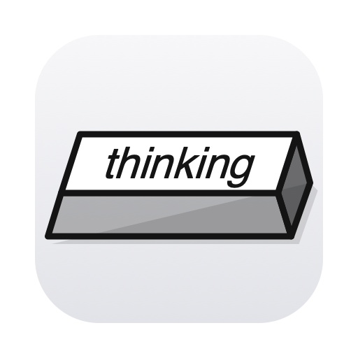

<p align="center">
  
</p>

# aI'm Thinking

[](https://github.com/den0206/aI-m-Thinking/actions/workflows/core.yml)
[](https://github.com/den0206/aI-m-Thinking/actions/workflows/app.yml)
[](https://github.com/den0206/aI-m-Thinking/actions/workflows/release.yml)

**English** | [日本語](README_JP.md)

A macOS menu bar app that detects Claude Code / Codex activity and plays keyboard sounds that follow how hard the agent is thinking, generating, and editing.

<p align="center">
  
</p>

Start your agents the usual way:

```bash
claude
codex
```

No wrapper command such as `agent-sound claude`, no alias, no shell hook, and no changes to Claude/Codex settings are needed.

## Requirements

- macOS 26.0 or later
- Apple Silicon
- For development: Xcode 27 / Swift 6.4 / Rust toolchain

The Swift toolchain is pinned to `6.4.0` by `.swift-version` at the repository root.

## Install

Download the latest `aIm-Thinking-X.Y.Z.dmg` from GitHub Releases and move `aI'm Thinking.app` to `/Applications`.

Builds are distributed from **this repository's own GitHub Releases**; there is no separate release repository.

> The release CI builds on Apple Silicon runners, so distributed builds target Apple Silicon.

## Features

- Passive monitoring of Claude Code / Codex started the normal way
- State estimation: THINKING / WRITING / TOOL / IDLE
- Keyboard sound speed that follows activity intensity
- Six keyboard sound sets
- Random sound per turn / adjustable typing speed
- Menu bar key animation that follows activity
- Volume / Mute
- Start at Login
- Automatic rescan after sleep / wake
- Fail-open design that never rewrites agent configuration files

## Privacy / resource policy

- Does not modify `~/.claude/settings.json`, `~/.codex/config.toml`, or shell rc files
- Opens Claude/Codex JSONL files read-only
- Does not replay history from before launch
- Never persists prompts, responses, reasoning, source code, or tool output on the aI'm Thinking side
- Does not keep whole JSONL files in memory
- Session / event / audio state is bounded
- Claude Code / Codex keep running even if aI'm Thinking stops

Details: [Technical Design](docs/TECHNICAL_DESIGN.md)

## Development

### VS Code / Cursor

`.vscode/launch.json` and `.vscode/tasks.json` are included.

1. Install CodeLLDB (`vadimcn.vscode-lldb`)
2. Open the repository root in VS Code / Cursor
3. Select **Run aI'm Thinking Debug.app** in Run and Debug
4. Press **F5**

F5 builds the following automatically:

```text
.build/debug/aI'm Thinking Debug.app
```

The debug build is kept separate from the release build.

| | Release | Debug |
|---|---|---|
| App name | aI'm Thinking | aI'm Thinking Debug |
| Bundle ID | `com.den0206.AImThinking` | `com.den0206.AImThinking.debug` |
| Build | release | debug |

To debug the App Store build (sandbox and folder access), select **Run aI'm Thinking App Store Debug.app** and press F5.

To debug the Rust core on its own, select **Run Rust Core** and press F5.

Details: [Development Guide](docs/DEVELOPMENT.md)

For bug reports, reproduce the issue and click **Copy Diagnostic Log** in the app menu. Share the copied text. The log keeps the latest 4,000 entries in memory, including session state, turn-end events, and read errors. Conversation content, tool arguments/output, and file paths are excluded. Logs are cleared when the app exits.

A bounded metadata scan runs every 3 seconds to recover missing macOS notifications. Existing transcripts keep their startup EOF baselines; only new appended content is processed.

### CLI

```bash
cargo test --manifest-path core/Cargo.toml
cargo clippy --manifest-path core/Cargo.toml --all-targets -- -D warnings

swift build --package-path app
swift test --package-path app

CONFIG=debug ./scripts/build-app.sh
open ".build/debug/aI'm Thinking Debug.app"
```

### App icon

The icon is generated by `app/Resources/AppIcon/generate_icon.py`. Edit the `CONFIG` section at the top of that file (label, colors, keycap size, ...), then regenerate `AppIcon.svg`, `app/Resources/AppIcon.icns`, and `docs/images/icon.png`:

```bash
./scripts/make-icon.sh
```

## Release build

Local release bundle:

```bash
./scripts/build-app.sh
```

Output:

```text
.build/release/aI'm Thinking.app
```

To sign with a Developer ID:

```bash
SIGN_IDENTITY="Developer ID Application: Your Name (TEAMID)" \
  ./scripts/build-app.sh
```

### Release

Pushing a `release/Ver_X.Y.Z` branch runs the Release workflow, which:

1. Runs Rust / Swift tests
2. Moves `[Unreleased]` in `CHANGELOG.md` under `X.Y.Z`
3. Builds, signs, and notarizes the DMG and attaches it to the `vX.Y.Z` GitHub Release with that changelog section as notes
4. Builds the Mac App Store package, uploads it, sets the changelog section as What's New, and submits it for review
5. Commits the updated `CHANGELOG.md` to `main`

```bash
git switch -c release/Ver_0.1.0
git push origin release/Ver_0.1.0
```

See the [Release Guide](docs/RELEASE.md) for required secrets and certificate setup.

## Documentation

- [Development Guide](docs/DEVELOPMENT.md)
- [Release Guide](docs/RELEASE.md)
- [Mac App Store Readiness](docs/APP_STORE.md)
- [Manual Verification Checklist](docs/checklists/manual-verification.md)
- [Technical Design](docs/TECHNICAL_DESIGN.md)
- [Parser Rules](docs/PARSER_RULES.md)
- [IPC Protocol](docs/PROTOCOL.md)
- [Resource Limits](docs/RESOURCE_LIMITS.md)
- [CHANGELOG](CHANGELOG.md)

## Project layout

```text
app/                    Swift / SwiftUI menu-bar app
core/                   Rust observer/parser/activity engine
scripts/build-app.sh    Debug/Release .app assembly + codesign
scripts/make-dmg.sh     DMG packaging
scripts/make-icon.sh    App icon (.icns) generation
scripts/clean.sh        Remove build outputs and test leftovers
.vscode/                VS Code / Cursor debug configuration
.github/workflows/      CI / Release workflows
docs/                   Design / development / release documents
```

## Status

Pending on-device checks are tracked in the [Manual Verification Checklist](docs/checklists/manual-verification.md).

## License

Copyright (c) 2026 Yuuki Sakai.

Original code in this repository is licensed under the GNU General Public License
version 3 only (`GPL-3.0-only`). See [LICENSE](LICENSE) for the full terms.

- Commercial use is allowed.
- Private modifications do not require publication.
- If you distribute this software or a modified version, you must comply with
  GPL-3.0, including licensing the covered work under GPL-3.0 and providing its
  corresponding source code to recipients. That includes the scripts needed to
  build and install it; a link to the unmodified upstream source does not cover
  your own changes.

Source for official GitHub releases is available from the matching `vX.Y.Z` tag
in [this repository](https://github.com/den0206/aI-m-Thinking). Build instructions
are in [Development Guide](docs/DEVELOPMENT.md).

Official Mac App Store binaries are separately licensed by the copyright holder
under the terms presented in the App Store. This does not change the GPL-3.0
license of the source in this repository or grant third parties an exception
from GPL-3.0.

Third-party dependencies and assets retain their own licenses. In particular,
the recorded sound samples remain CC0; see
[Sound credits](app/Resources/Sounds/CREDITS.md).
